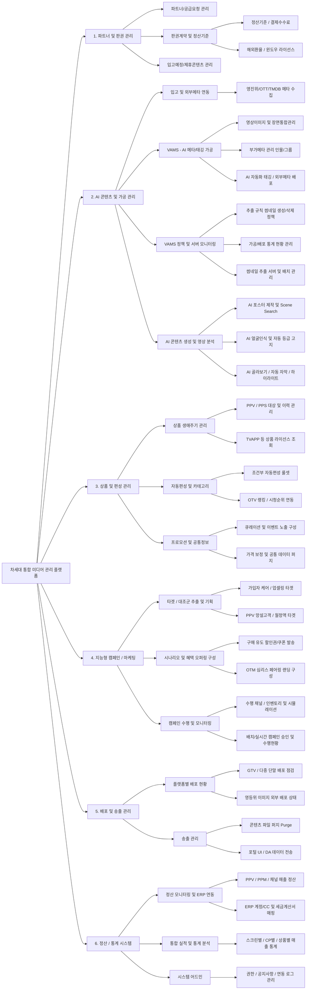

# 미디어AX 프로젝트 기획서

> **프로젝트명:** 미디어AX (Media AI Transformation)
> **대상 조직:** KT 지니TV VOD 서비스 운영사
> **최종 사용자:** 사내 편성/제작 담당자 + 외부 클라이언트 (CP사, 광고주)
> **현재 단계:** 상세 설계 완료
> **목표:** 6개 하부 프로젝트 + 공통 인프라를 개별 설계 후 통합 웹 솔루션으로 구현

---

## 1. 하부 프로젝트 구성

| No | 하부 프로젝트 | 설계 상태 | 모듈/섹션 수 | 핵심 책임 |
|----|-------------|-----------|-------------|----------|
| 1 | 편성 기획 AX | ✅ 확정 | 5개 모듈 | 메타데이터 + 카탈로그 + 큐레이션 + 결재 + CP수급 |
| 2 | 디자인 AX | ✅ 확정 | 9개 섹션 | 이미지 자동 생성 + 템플릿 + DAM |
| 3 | 인제스트 AX | ✅ 확정 | 11개 섹션 | 수신 → 인코딩 → QC → DRM → CDN |
| 4 | 통계 AX | ✅ 확정 | 7개 섹션 | 시청/매출/행동 분석 + CP 정산 |
| 5 | 마케팅 AX | ✅ 확정 | 7개 섹션 | 프로모션 + CRM/푸시 + 광고 상품 |
| 6 | 모니터링 AX | ✅ 확정 | 8개 섹션 | 장애/품질/보안/운영 감시 |
| 공통 | 공통 인프라 레이어 | ✅ 확정 | 10개 섹션 | IAM + 알림 + MDM + 스토리지 + DW + 검색 + 스케줄러 |

---

## 2. 기술 스펙 (MVP 확정)

### 프론트엔드
- **프레임워크:** Next.js 16 + TypeScript
- **모노레포:** Turbo monorepo — `mediaX-CMS/`
- **UI 패키지:** `@workspace/ui` (shadcn/ui + Tailwind CSS v4)

### 백엔드
- **프레임워크:** Python FastAPI

### AI 엔진 (외부 API — GPU 없음)
- **텍스트 분석:** Claude API 또는 OpenAI GPT-4o
- **이미지 분석:** Claude Vision 또는 GPT-4o Vision
- **얼굴 인식:** AWS Rekognition 또는 Google Cloud Vision
- **OCR:** Naver Clova OCR 또는 Google Vision OCR

### 데이터베이스
- **메인 DB:** PostgreSQL
- **검색:** Elasticsearch
- **캐시:** Redis

### 작업 큐
- **Celery + Redis**

### 인프라 (로컬 MVP)
- Docker Compose / Nginx / Grafana + Prometheus

### 개발 환경
- 팀 1~2명, Python + JS/TS, 로컬 서버

### 프로젝트 구조
```
mediaX/
├── mediaX-CMS/                  # Turbo 모노레포 (프론트엔드)
│   ├── apps/
│   │   └── web/                 # Next.js 16 앱 (App Router)
│   │       ├── app/(main)/      # 메인 레이아웃 라우트 그룹
│   │       ├── components/layout/  # AppSidebar, Header
│   │       ├── config/          # site-config.ts, docs.ts
│   │       └── lib/             # nav.ts 네비게이션 헬퍼
│   └── packages/
│       ├── ui/                  # @workspace/ui 공유 컴포넌트
│       ├── typescript-config/
│       └── eslint-config/
├── backend/
│   ├── api/
│   │   ├── programming/   # 편성 기획 AX API
│   │   ├── design/        # 디자인 AX API
│   │   ├── ingest/        # 인제스트 AX API
│   │   ├── analytics/     # 통계 AX API
│   │   ├── marketing/     # 마케팅 AX API
│   │   ├── monitoring/    # 모니터링 AX API
│   │   └── common/        # 공통 인프라 API
│   ├── workers/           # Celery 워커
│   └── shared/            # 공통 스키마/타입
├── docker-compose.yml
└── docs/
```

---

## 3. 편성 기획 AX — ✅ 확정

### 개요
- **미션:** 지니TV VOD 편성 기획 전 과정에 AI 적용, 데이터 기반 의사결정 체계 구축
- **월 신규 VOD:** 1,000~5,000건 / **장르:** 전 장르 / **메타 입력:** 혼재 (CP마다 다름)

### 모듈 구성 (5개)

### 모듈 1. 메타데이터 AI 자동 분류 (최우선)

#### 1-1. 데이터 입수 파이프라인
- **CP사 제공 메타** (비표준) + **웹 크롤링 보강** (TMDB/KMDB) + **영상 원본 연동** (인제스트 AX)
- 메타 표준화 레이어: 통합 스키마 정규화, 장르 코드 매핑, 인물명 통일 사전

#### 1-2. AI 처리 엔진 (5개)
- **A. 장르/카테고리/태그 자동 분류** — NLP + Vision 분석
- **B. 시놉시스·줄거리 자동 생성** — 품질 판정 + 자동 재생성 + 스포일러 등급
- **C. 인물 정보 자동 태깅** — OCR + 얼굴 인식 + 인물 DB 매칭
- **D. 감성·분위기 태깅** — 색감/음악/대사 종합 (#따뜻한 #긴장감 등)
- **E. 메타 품질 스코어링** — 0~100점, 70점 미만 검수 큐 자동 등록

#### 1-3. 워크플로우
```
CP 메타 수신 → 표준화 → 5개 AI 엔진 병렬 → 품질 스코어
  → 90점↑ 자동 등록 / 70~89점 담당자 리뷰 / 70점↓ AI 보강+필수 검수
```

#### 1-4. UI: 메타 대시보드, 검수 큐, 품질 리포트, 분류 체계 관리

#### 1-5. 연동: 인제스트AX ← 영상분석, 모듈2 → 분류결과, 모듈3 → 감성태그, 디자인AX → 태그

---

### 모듈 2. VOD 카탈로그 관리 자동화

#### 2-1. 서비스 카테고리 트리 — 유동적 N-depth, 다중 분류, AI 자동 매핑 제안
#### 2-2. 콘텐츠 유형 — 단편(Single) / 시리즈(Series: 시즌>에피소드), 전체/시즌/개별 구매

#### 2-3. 가격 정책 — SD/HD/FHD/4K × 개별구매/시즌패키지/평생소장 매트릭스
- CP별 템플릿, 장르별 룰, 일괄 변경, 변경 이력, AI 최적가 추천

#### 2-4. 홀드백 정책 — CP별 윈도우 템플릿, 전환 알림 → 수동 가격 변경, 캘린더 뷰

#### 2-5. 자동 등록 파이프라인
```
CP 메타 → 파싱 → 모듈1 AI분류 → 중복탐지 → 유형판별 → 카테고리매핑
  → 가격산정 → 품질확인 → 등록/승인/반려
```

#### 2-6. 중복 탐지 — 텍스트매칭 → 영상핑거프린트 → AI판단 3단계
#### 2-7. 라이선스 만료 — D-90~D-1 알림, 자동 비공개, 갱신 AI 추천
#### 2-8. 라이프사이클 — [수신]→[검수]→[등록]→[편성]→[서비스중-WindowN]→[만료]→[종료]

#### 2-9. DB (11개): categories, contents, series, episodes, pricing, holdback_policies, holdback_schedules, content_categories, price_change_log, licenses, lifecycle_events

---

### 모듈 3. 홈 큐레이션 AI

#### 3-1. 홈 슬롯 구조 — 배너/테마관/개인화/장르/랭킹/프로모션, 디바이스별/시간대별 설정
#### 3-2. 배너 AI 편성 — 주간 편성안 자동 생성, CTR 예측 기반
#### 3-3. 기획전 자동 생성 — 트렌드 감지 → 테마/콘텐츠/제목/썸네일 자동 구성
#### 3-4. 개인화 추천 — 협업필터링 + 콘텐츠기반 + 컨텍스트(시간/요일) 3단계
#### 3-5. 트렌드 감지 — 내부(시청/검색) + 외부(SNS/뉴스) 실시간
#### 3-6. A/B 테스트 — 배너/기획전/추천/슬롯 테스트, 자동 유의성 판정

#### 3-7. DB (9개): home_slots, slot_contents, curations, curation_contents, recommendations, trends, ab_tests, ab_test_results, curation_performance

---

### 모듈 4. 편성 결재·워크플로우 (신규 보강)

**미션:** 편성 관련 변경사항의 승인 플로우 자동화, 변경 이력 추적, 이상 편성 사전 감지

#### 4-1. 결재 대상 액션

| 액션 | 결재 유형 | 결재선 |
|------|----------|--------|
| 콘텐츠 등록 (70~89점) | 단계 승인 | 담당자 → 관리자 |
| 가격 변경 | 단계 승인 | 담당자 → 관리자 |
| 홀드백 수동 전환 | 단계 승인 | 담당자 → 관리자 |
| 배너/기획전 확정 | 단계 승인 | 담당자 → 관리자 |
| 긴급 비공개 | 즉시 실행 + 사후 보고 | 담당자 |
| 메타 90점↑ 자동 등록 | 자동 | — |

#### 4-2. 워크플로우 엔진
```
액션 → 결재 유형 판별 → 결재선 라우팅 → 알림
  → 승인: 실행+이력 / 반려: 사유+재요청 / 48h 미처리: 에스컬레이션
```

#### 4-3. 이상 편성 감지 — 중복편성, 라이선스위반, 가격이상, 등급부적합
#### 4-4. 변경 이력·버전 관리 — 전수 기록, 스냅샷, 되돌리기, 버전 비교

#### 4-5. DB (6개): approval_requests, approval_steps, approval_rules, change_history, change_versions, anomaly_detections

---

### 모듈 5. CP사 콘텐츠 수급 관리 (신규 보강)

**미션:** CP별 성과 분석, 수급 우선순위 AI 스코어링, 계약 갱신/신규 수급 자동 알림

#### 5-1. CP 성과 대시보드 — 시청/매출/랭킹/메타품질/수급현황, CP 비교 분석
#### 5-2. 수급 AI 스코어링 — 과거성과 + 트렌드 + 자사시청패턴 + 경쟁분석 → 0~100점
#### 5-3. 계약 관리 — D-90/D-60/D-30 알림, 갱신 가치 판단, 장르 공백 분석 → 수급 제안

#### 5-4. DB (4개): cp_performance, supply_scores, supply_recommendations, contract_alerts

---

## 4. 디자인 AX — ✅ 확정

**미션:** AI 이미지 자동 생성 + 템플릿 대량 생산 (월 500~2,000건, KT/지니TV CI 준수)

### D-1. 사이즈 체계 — TV(16:9)/모바일(9:16)/웹, 자동 리사이즈/리레이아웃
### D-2. AI 생성 — 템플릿 기반 자동(주력) + AI 생성형(보조: DALL-E/Midjourney/SD)
### D-3. 템플릿 관리 — 장르/유형/시즌별, 성과 랭킹, 에디터
### D-4. 배치 시스템 — Celery 비동기, 일괄 승인/수정, CDN 배포
### D-5. 브랜드 검수 — 로고/폰트/컬러/등급 자동 체크, 자동 보정
### D-6. 웹 에디터 — 미세 조정, 멀티 디바이스 프리뷰
### D-7. DAM — 중앙 저장소, 태그 검색, 버전/사용현황 추적

### D-8. 연동: 편성모듈1←태그, 편성모듈2←등록트리거, 편성모듈3←기획전커버, 마케팅←배너트리거, 인제스트←스틸컷, 모니터링→실패알림

### D-9. DB (9개): design_templates, design_assets, design_batches, design_batch_items, brand_rules, brand_check_logs, source_images, asset_usage, design_versions

---

## 5. 인제스트 AX — ✅ 확정

**미션:** CP사 영상 수신→인코딩→QC→DRM→자막→AI분석→CDN 전체 자동화

### I-1. 수신 — FTP/API/클라우드, 체크섬 검증, 메타 추출, CP 업로드 포털
### I-2. 인코딩 — SD/HD/FHD/4K 멀티 프로파일, FFmpeg 병렬, AI 비트레이트 최적화
### I-3. QC — 영상(블랙/프리즈/컬러)+오디오(무음/싱크)+무결성 AI 자동 검수
### I-4. DRM — Widevine/PlayReady/FairPlay, DASH/HLS, 라이선스 정책
### I-5. 자막/더빙 — 포맷변환, 싱크검증, AI STT, 다국어번역, 멀티오디오
### I-6. AI 분석 — 스틸컷추출, 얼굴인식, 음성분석, 부적절감지, 핑거프린트
### I-7. CDN — 매니페스트, ABR, 엣지배포, 테스트재생
### I-8. 전체 흐름: 업로드→검증→인코딩→QC→DRM→자막→AI분석→CDN→서비스

### I-9. 대시보드 — 파이프라인 현황, QC률, 스토리지, 처리시간

### I-10. 연동: 편성모듈1→분석결과, 편성모듈2→핑거프린트/CDN, 디자인→스틸컷, 모니터링→상태

### I-11. DB (12개): ingest_jobs, ingest_stages, source_files, encoded_files, qc_results, drm_packages, subtitles, audio_tracks, video_analysis, stillcuts, fingerprints, cdn_deployments

---

## 6. 통계 AX — ✅ 확정 (독립 프로젝트)

**미션:** 시청/매출/행동/정산 통합, 실시간 대시보드 + 자동 리포트 + AI 예측

### S-1. 데이터 수집 — 시청/매출/행동/정산 4개 파이프라인
### S-2. 대시보드 — 경영진/편성/CP관리/마케팅 4종
### S-3. 자동 리포트 — 일간/주간/월간/정산서/분기, AI 코멘터리
### S-4. AI 엔진 — 시청량예측, 매출예측, 이상감지, 자연어질의(Ask AI)
### S-5. CP 정산 — 자동집계→비율적용→정산서→발송→이의신청
### S-6. 연동: 편성모듈1/2/3←데이터, 편성모듈5(CP)→성과, 마케팅↔성과, 모니터링→상태
### S-7. DB (10개): viewing_logs, sales, user_actions, settlements, settlement_details, settlement_disputes, reports, predictions, anomalies, dashboard_configs

---

## 7. 마케팅 AX — ✅ 확정 (독립 프로젝트)

**미션:** 프로모션 자동화, 사용자 세그먼트 AI, 개인화 CRM, 광고 상품 운영

### M-1. 프로모션 — AI 기획(트리거→초안→ROI시뮬→집행→성과→종료), 시뮬레이션
### M-2. 세그먼트 — 7종 자동분류 + AI 클러스터링, 이탈/구매 예측
### M-3. CRM — 푸시/SMS/인앱/이메일, AI 최적화(콘텐츠/메시지/시간/채널), 자동 시퀀스
### M-4. 광고 — 프리롤/배너/기획전/검색, 인벤토리관리, 타겟팅, 광고주 포털
### M-5. ROI — 실시간성과→AI분석→최적화(예산/타겟/메시지)→최종리포트
### M-6. 연동: 편성모듈1/2/3←트리거/태그, 통계↔데이터, 디자인→배너트리거, 모니터링→로그
### M-7. DB (10개): campaigns, promotions, coupons, segments, segment_users, push_logs, ad_inventory, ad_campaigns, ad_performance, campaign_roi

---

## 8. 모니터링 AX — ✅ 확정 (독립 프로젝트)

**미션:** 장애/품질/보안 통합 모니터링, AI 장애 예측/사전 감지

### MO-1. 4개 영역 — 인프라/VOD서비스/콘텐츠품질/보안
### MO-2. AI 감지 — 임계값(1단계) → 이상탐지(2단계) → 장애예측(3단계)
### MO-3. 대시보드 — 헬스스코어(0~100), 4영역 실시간, AI 알림 타임라인
### MO-4. 알림 — P1긴급(5분)/P2경고(15분)/P3주의(1시간)/P4정보(당일), 에스컬레이션
### MO-5. 장애 대응 — 감지→알림→인시던트→AI원인분석→대응→해결→RCA리포트
### MO-6. 로그 — Filebeat→Elasticsearch→Kibana, AI 이상 하이라이트, 감사로그 3년
### MO-7. 연동: 전체←헬스/로그, 인제스트←QC실패, 마케팅←발송실패, 통계↔시스템지표
### MO-8. DB (10개): health_metrics, alerts, alert_rules, incidents, incident_timeline, audit_logs, security_logs, content_quality_checks, anomalies, on_call_schedules

---

## 9. 공통 인프라 레이어 — ✅ 확정

### 9-1. 통합 인증/권한 관리 (IAM)

**인증:** KT SSO + 자체 로그인, JWT(Access15분/Refresh7일), 2FA, 비밀번호 정책

**RBAC:**

| 역할 | 접근 범위 |
|------|----------|
| 시스템 관리자 | 전체 |
| 편성 관리자 | 편성 기획 AX 전체 + 승인 |
| 편성 담당자 | 담당 모듈 CRUD + 승인 요청 |
| 디자이너 | 디자인 AX + 편성 모듈 3 열람 |
| 인제스트 담당자 | 인제스트 AX + 편성 모듈 1 열람 |
| 마케팅 담당자 | 마케팅 AX + 모듈 3 일부 |
| 경영진 | 통계 대시보드 (읽기 전용) |
| CP사 담당자 | CP 포털 (자사만) |
| 광고주 | 광고 포털 (자사만) |

**외부 포털:** CP사(업로드/정산/성과/이의신청), 광고주(캠페인/성과/예산)
**보안:** HTTPS, CORS, Rate Limiting, bcrypt, AES-256, 비정상 접근 감지

### 9-2. 통합 알림 — 전 모듈 단일 처리, 슬랙/이메일/SMS/푸시, 커스텀, 중복 억제
### 9-3. MDM — CP마스터, 인물DB, 장르코드, 디바이스코드
### 9-4. 파일 스토리지 — 통합 관리, 핫/콜드 정책, 사용량 모니터링
### 9-5. DW — 전 모듈 통합 적재, ETL 자동화
### 9-6. 통합 검색 (신규) — Elasticsearch, 자동완성/오타보정/동의어, 권한 필터링
### 9-7. 배치 스케줄러 (신규) — Celery Beat, 리포트/정산/알림/동기화/만료체크/트렌드, 관리 UI
### 9-8. API 버전 관리 (신규) — /v1/ /v2/, 6개월 하위 호환, 자동 문서
### 9-9. 로깅 표준 (신규) — JSON 포맷, Correlation ID, 레벨 정책, 보존(일반90일/감사3년/보안1년)

### 9-10. DB (18개)
- **IAM 10개:** users, roles, permissions, role_permissions, user_roles, sessions, login_history, password_history, ip_whitelist, permission_change_log
- **알림 2개:** notifications, notification_preferences
- **마스터 4개:** master_cp, master_persons, master_genre_codes, master_device_codes
- **스케줄러 2개:** scheduled_jobs, job_execution_logs

---

## 10. 통합 아키텍처

### 10-1. 모듈 간 데이터 흐름

```
[CP사] ──영상──→ [인제스트 AX]
                      │
         ┌────────────┼──────────────┐
         ▼            ▼              ▼
    스틸컷/분석    핑거프린트/CDN   자막/감성
         │            │              │
         ▼            ▼              ▼
    [디자인 AX]  [편성 기획 AX]  [편성 기획 AX]
    썸네일/배너   모듈2 카탈로그   모듈1 메타데이터
         │            │              │
         └─────┬──────┘              │
               ▼                     │
         [편성 기획 AX] ←────────────┘
          모듈3 큐레이션
          모듈4 결재
          모듈5 CP수급
               │
     ┌─────────┼─────────┐
     ▼         ▼         ▼
[마케팅 AX] [통계 AX] [모니터링 AX]
 프로모션    시청/매출    장애/보안
 CRM/광고   정산/예측    품질/감사
```

### 10-2. 핵심 연동 인터페이스 (API 계약 18개)

| ID | 제공자 → 소비자 | 데이터 |
|----|----------------|--------|
| A | 인제스트 → 편성 모듈 1 | 얼굴인식, 음성분석, 자막, 감성 |
| B | 인제스트 → 편성 모듈 2 | 핑거프린트, 서비스URL, CDN |
| C | 인제스트 → 디자인 | 스틸컷/키프레임 소스 |
| D | 편성 모듈 1 → 편성 모듈 2 | 메타 분류, 품질 스코어 |
| E | 편성 모듈 1 → 디자인 | 장르/감성 태그 |
| F | 편성 모듈 2 → 편성 모듈 3 | 신규 콘텐츠, 홀드백, 만료 |
| G | 편성 모듈 1 → 편성 모듈 3 | 감성 태그, 인물 정보 |
| H | 편성 모듈 2 → 마케팅 | 가격/신규/홀드백 트리거 |
| I | 편성 모듈 3 → 마케팅 | 트렌드, 큐레이션 슬롯 |
| J | 편성 모듈 2 → 통계 | 가격/라이선스/카탈로그 |
| K | 편성 모듈 3 → 통계 | 큐레이션 성과 |
| L | 마케팅 → 통계 | 캠페인 성과 |
| M | 통계 → 편성 모듈 3 | 시청 데이터 (추천 입력) |
| N | 통계 → 마케팅 | 행동/세그먼트 데이터 |
| O | 전체 → 모니터링 | 헬스/로그/감사 이벤트 |
| P | 디자인 → 편성 모듈 3 | 기획전 커버 이미지 |
| Q | 마케팅 → 디자인 | 프로모션 배너 트리거 |
| R | 통계 → 편성 모듈 5 | CP별 시청/매출 데이터 |

### 10-3. 시스템 아키텍처

```
┌──────────────────────────────────────────────────┐
│                프론트엔드 (Next.js)                │
│  편성기획 | 디자인 | 인제스트 | 통계 | 마케팅 | 모니터링  │
│  CP 포털 | 광고주 포털                              │
├──────────────────────────────────────────────────┤
│              API Gateway (Nginx)                  │
├──────────────────────────────────────────────────┤
│               백엔드 (FastAPI)                    │
│  programming/ | design/ | ingest/ | analytics/    │
│  marketing/   | monitoring/ | common/             │
├──────┬──────┬───────┬───────┬──────┬─────────────┤
│ IAM  │ 알림  │ MDM   │ 검색   │스케줄러│ 스토리지  │
├──────┴──────┴───────┴───────┴──────┴─────────────┤
│  PostgreSQL │ Elasticsearch │ Redis │ DW          │
├──────────────────────────────────────────────────┤
│  Celery Workers (인코딩/AI분석/배치디자인/리포트/정산)  │
├──────────────────────────────────────────────────┤
│  외부 API: Claude/GPT | Vision AI | OCR | DRM     │
├──────────────────────────────────────────────────┤
│  Docker Compose (로컬 MVP)                        │
└──────────────────────────────────────────────────┘
```

### 10-4. DB 테이블 전체 현황

| 영역 | 테이블 수 |
|------|----------|
| 편성 모듈 1 (메타) | 공유 |
| 편성 모듈 2 (카탈로그) | 11개 |
| 편성 모듈 3 (큐레이션) | 9개 |
| 편성 모듈 4 (결재) | 6개 |
| 편성 모듈 5 (CP수급) | 4개 |
| 디자인 AX | 9개 |
| 인제스트 AX | 12개 |
| 통계 AX | 10개 |
| 마케팅 AX | 10개 |
| 모니터링 AX | 10개 |
| 공통 인프라 | 18개 |
| **합계** | **약 99개** |

---

## 11. 비즈니스 모듈 구성 — 차세대 통합 미디어 관리 플랫폼

> 기술 모듈(편성AX/디자인AX/인제스트AX 등) 위에서 비즈니스 관점으로 재정의한 6개 도메인 구성.
> 각 비즈니스 모듈은 하나 이상의 기술 모듈을 포괄한다.



### 비즈니스 모듈 ↔ 기술 모듈 매핑

| 비즈니스 모듈 | 핵심 시스템 | 대응 기술 모듈 |
|-------------|-----------|--------------|
| M1. 파트너 및 판권 관리 | CMT | 1_programming/1.5_cp_supply + 신규 CMT 기능 |
| M2. AI 콘텐츠 및 가공 관리 | CMS + VAMS + AI Dashboard | 1_programming/1.1_metadata + 3_ingest/3.6 + 2_design |
| M3. 상품 및 편성/큐레이션 | PMS | 1_programming/1.2_catalog + 1.3_curation + 5_marketing/5.1 |
| M4. 지능형 캠페인/마케팅 | 마케팅 자동화 | 5_marketing (전체) |
| M5. 배포 및 송출 관리 | AMOC | **10_distribution (신규)** + 3_ingest/3.7 |
| M6. 정산/통계 시스템 | ERP 연동 | 4_analytics + 7_common_infra/IAM |

### 기존 docs 대비 신규/보완 필요 항목

| 구분 | 항목 | 상태 |
|------|------|------|
| 신규 | 10_distribution/ (AMOC — 배포/송출 관리) | ❌ 완전 누락 |
| 보완 | CMT 판권계약 / 정산기준 / 해외환율 / 윈도우 라이선스 | ⚠️ 기존 1.5에 부재 |
| 보완 | VAMS 장면통합관리 / 썸네일 서버 / 외부메타 배포 | ⚠️ 기존 1.1에 부재 |
| 보완 | 영진위/OTT/TMDB 외부 메타 수집 파이프라인 | ⚠️ 개략만 언급 |
| 보완 | AI 골라보기 / 하이라이트 / Scene Search | ⚠️ 미기술 |
| 보완 | AI 자동 등급 고지 | ⚠️ 미기술 |
| 보완 | ERP 계정/CC / 세금계산서 매핑 | ⚠️ 정산 문서에 부재 |
| 보완 | OTM 심리스 페어링 랜딩 | ⚠️ 마케팅 문서에 부재 |
| 보완 | PPV 망설고객 / 업셀링 타겟 세분화 | ⚠️ 세그먼트 문서에 부재 |
| 보완 | GTV 다중 단말 배포 점검 / 영등위 이미지 배포 상태 | ⚠️ 미기술 |
| 보완 | 조건부 자동편성 룰셋 / OTV 랭킹 연동 | ⚠️ 큐레이션 문서에 부재 |
| 보완 | TVAPP 상품 라이선스 조회 | ⚠️ 카탈로그 문서에 부재 |

---

## 12. 다음 단계 (TODO)

- [x] ~~편성 기획 AX 상세 설계 (5개 모듈)~~
- [x] ~~디자인 AX 상세 설계~~
- [x] ~~인제스트 AX 상세 설계~~
- [x] ~~통계 AX 상세 설계 (독립)~~
- [x] ~~마케팅 AX 상세 설계 (독립)~~
- [x] ~~모니터링 AX 상세 설계 (독립)~~
- [x] ~~공통 인프라 레이어 (10개 섹션)~~
- [x] ~~전체 통합 점검 + 구조 재정리~~
- [ ] 모듈별 UI 와이어프레임 (라이트 테마)
- [ ] DB 스키마 상세 설계 (전체 통합 ERD ~99개 테이블)
- [ ] API 명세서 작성 (연동 인터페이스 18개)
- [ ] MVP 개발 로드맵 및 우선순위 확정
- [ ] MVP 개발 착수

---

*작성일: 2026-04-05*
*최종 수정: 2026-04-09*
*진행 상황: 6개 하부 프로젝트 + 공통 인프라 전체 상세 설계 완료, 구조 재정리 완료*
*변경 이력:*
- *2026-04-05: 통계/마케팅/모니터링 독립 프로젝트 분리, 편성 결재 워크플로우·CP 수급 관리 신규 보강, 공통 인프라 4개 항목 추가 (검색/스케줄러/API관리/로깅)*
- *2026-04-09: 비즈니스 모듈 구성(M1~M6) 추가 — CMT/VAMS/PMS/AMOC 관점 반영, 10_distribution 신규 모듈 식별, 기존 문서 대비 보완 항목 목록화*
