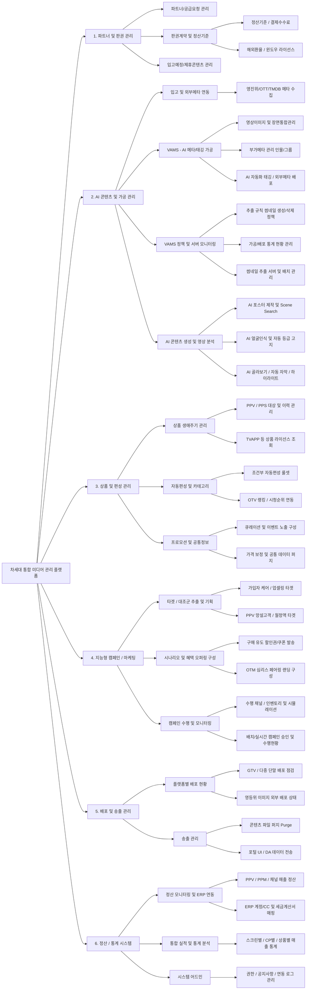

# 0.2 비즈니스 모듈 구조 — 차세대 통합 미디어 관리 플랫폼

> 기술 모듈(편성AX/디자인AX/인제스트AX 등)과 별개로, **비즈니스 도메인 관점**에서 플랫폼을 6개 모듈로 재정의한 구조다.
> 각 비즈니스 모듈은 하나 이상의 기술 모듈을 포괄하며, 실제 운영자의 업무 흐름에 맞춰 구성된다.

---

## 전체 구성도

---

## 비즈니스 모듈별 상세 설명

### M1. 파트너 및 판권 관리 (CMT 중심)

CP사·파트너와의 계약 전 과정을 관리한다. 콘텐츠 공급 요청 접수부터 판권 계약, 정산 기준 설정, 윈도우 라이선스 관리까지를 포괄한다.

| 기능 | 설명 | 현재 문서 |
|------|------|----------|
| 파트너/공급요청 관리 | 신규 CP사 등록, 공급 요청 접수 및 검토 | `1.5_cp_supply` |
| 판권계약 | 계약 체결, 조건 관리, 만료 알림 | `1.5.3_contract_mgmt` |
| 정산기준 / 결제수수료 | CP별 수익 배분 비율, 수수료 설정 | **보완 필요** |
| 해외환율 | 해외 CP 정산 시 환율 기준 관리 | **신규 작성 필요** |
| 윈도우 라이선스 | 극장→VOD→TV 등 서비스 창구별 권리 기간 | `1.2.3_holdback` (부분) |
| 입고예정/제휴콘텐츠 관리 | 향후 입고 예정 콘텐츠 파이프라인, 제휴 콘텐츠 | **신규 작성 필요** |

---

### M2. AI 콘텐츠 및 가공 관리 (CMS + VAMS + AI Dashboard)

콘텐츠 메타데이터 수집·가공·배포의 전 과정을 AI로 자동화한다. VAMS(Video Asset Management System)가 핵심 시스템이다.

#### M2-1. 입고 및 외부메타 연동

| 기능 | 설명 | 현재 문서 |
|------|------|----------|
| 영진위 메타 수집 | 영화진흥위원회 데이터베이스 연동 | `1.1.1_data_pipeline` (언급만) |
| OTT 메타 수집 | 넷플릭스, 왓챠 등 OTT 시청 데이터 참조 | **보완 필요** |
| TMDB 메타 수집 | The Movie Database API 연동 | `1.1.1_data_pipeline` (언급만) |

#### M2-2. VAMS — AI 메타/태깅 가공

| 기능 | 설명 | 현재 문서 |
|------|------|----------|
| 영상이미지 및 장면통합관리 | 키프레임·스틸컷 추출, 장면 분류, 통합 뷰 | `3.6_ai_analysis` (부분) |
| 부가메타 관리 (인물/그룹) | 출연진·감독 인물DB 연동, 그룹 메타 | `1.1.0_metadata_overview` (부분) |
| AI 자동화 태깅 | 장르·분위기·키워드 자동 태깅 | `1.1.2_ai_engines` |
| 외부메타 배포 | 가공된 메타를 외부 플랫폼에 자동 배포 | **신규 작성 필요** |

#### M2-3. VAMS 정책 및 서버 모니터링

| 기능 | 설명 | 현재 문서 |
|------|------|----------|
| 추출 규칙 (썸네일 생성/삭제 정책) | 장면별 추출 조건, 삭제 주기 정책 | **신규 작성 필요** |
| 가공/배포 통계 현황 | 태깅 처리량, 배포 성공률, 오류율 대시보드 | **신규 작성 필요** |
| 썸네일 추출 서버 및 배치 관리 | 서버 스케일링, 배치 작업 모니터링 | `3.6_ai_analysis` (간략) |

#### M2-4. AI 콘텐츠 생성 및 영상 분석

| 기능 | 설명 | 현재 문서 |
|------|------|----------|
| AI 포스터 제작 | AI 생성형 이미지로 포스터 자동 제작 | `2.2_ai_generation` |
| Scene Search | 장면 내용으로 영상 구간 검색 | **신규 작성 필요** |
| AI 얼굴인식 | 출연진 자동 식별 및 태깅 | `3.6_ai_analysis` + `1.1.2_ai_engines` |
| 자동 등급 고지 | 영상 분석 기반 시청 등급 자동 판정 및 고지 | **신규 작성 필요** |
| AI 골라보기 | 사용자 취향 기반 핵심 장면 자동 선별 | **신규 작성 필요** |
| 자동 자막 | STT 기반 자막 자동 생성 | `3.5_subtitle` |
| AI 하이라이트 | 주요 장면 자동 편집 하이라이트 영상 생성 | **신규 작성 필요** |

---

### M3. 상품 및 편성/큐레이션 (PMS 중심)

VOD 상품의 생애주기 관리, 자동 편성, 큐레이션을 담당한다. PMS(Product Management System)가 핵심이다.

| 기능 | 설명 | 현재 문서 |
|------|------|----------|
| PPV/PPS 이력 관리 | 건당/시리즈 구매 대상 지정 및 판매 이력 | `1.2.7_lifecycle` (부분) |
| TVAPP 상품 라이선스 조회 | TV 앱 플랫폼 내 상품 라이선스 상태 조회 | **신규 작성 필요** |
| 조건부 자동편성 룰셋 | 특정 조건 충족 시 자동으로 편성 적용 | `1.3.3_theme_auto` (부분) |
| OTV 랭킹/시청순위 연동 | OTV 플랫폼 실시간 순위 데이터 연동 | **신규 작성 필요** |
| 큐레이션 및 이벤트 노출 구성 | 기획전·이벤트 배너 노출 설정 | `1.3.1_home_slots` |
| 가격 보정 및 공통 데이터 퍼지 | 가격 이상 자동 보정, 캐시 데이터 초기화 | **신규 작성 필요** |

---

### M4. 지능형 캠페인 / 마케팅 (마케팅 자동화 중심)

AI 기반 고객 타겟팅, 시나리오 설계, 캠페인 실행 자동화를 담당한다.

| 기능 | 설명 | 현재 문서 |
|------|------|----------|
| 가입자 케어/업셀링 타겟 | 해지 위험 고객·업그레이드 대상 자동 추출 | `5.2_segmentation` |
| PPV 망설고객 타겟 | 장바구니 이탈·구매 망설임 고객 타겟팅 | **보완 필요** |
| 월정액 타겟 | 월정액 전환 가능 고객 세그먼트 | `5.2_segmentation` (부분) |
| 구매 유도 할인권/쿠폰 발송 | 타겟별 맞춤 할인 혜택 자동 발송 | `5.1_promotion` |
| OTM 심리스 페어링 랜딩 | OTT 멤버십 결합 상품 랜딩 페이지 자동 구성 | **신규 작성 필요** |
| 수행 채널/인벤토리 및 시뮬레이션 | 채널별 발송 인벤토리 관리, 성과 시뮬레이션 | `5.4_ad_product` (부분) |
| 배치/실시간 캠페인 승인 및 수행현황 | 캠페인 승인 워크플로우, 실시간 현황 모니터링 | `5.3_crm_push` (부분) |

---

### M5. 배포 및 송출 관리 (AMOC 중심) ← **신규 모듈**

인코딩 완료된 콘텐츠를 플랫폼별로 배포하고, 송출 상태를 관리한다. AMOC(Asset Management & Output Control) 시스템이 핵심이다. 기존 docs에 전용 모듈이 없어 `10_distribution/`으로 신규 추가한다.

| 기능 | 설명 | 현재 문서 |
|------|------|----------|
| GTV/다중 단말 배포 점검 | 지니TV, 모바일, 웹 등 단말별 배포 상태 점검 | **신규 (10_distribution)** |
| 영등위 이미지 외부 배포 상태 | 영상물등급위원회 등급 이미지 배포 확인 | **신규 (10_distribution)** |
| 콘텐츠 파일 퍼지 (Purge) | CDN 캐시 강제 갱신, 파일 삭제 요청 | `3.7_cdn` (부분) → 이동 |
| 포털 UI/DA 데이터 전송 | 포털 화면 UI 구성 데이터, DA(Display Ad) 소재 전송 | **신규 (10_distribution)** |

---

### M6. 정산 / 통계 시스템

매출 정산, ERP 연동, 통합 실적 분석, 시스템 어드민을 담당한다.

| 기능 | 설명 | 현재 문서 |
|------|------|----------|
| PPV/PPM/채널 매출 정산 | 건당구매·월정액·채널별 매출 자동 집계 | `4.5_settlement` |
| ERP 계정/CC 및 세금계산서 매핑 | ERP 비용 계정·코스트센터 연동, 세금계산서 자동 발행 | **신규 작성 필요** |
| 스크린별/CP별/상품별 매출 통계 | 다차원 매출 분석 리포트 | `4.2_dashboards` (부분) |
| 권한/공지사항/연동 로그 관리 | 시스템 어드민 — IAM, 공지, API 연동 로그 | `7_common_infra/7.1_iam` |

---

## 기술 모듈 ↔ 비즈니스 모듈 역방향 매핑

| 기술 모듈 | 비즈니스 모듈 |
|----------|-------------|
| `1_programming/1.1_metadata` | M2 (AI 콘텐츠 및 가공 관리) |
| `1_programming/1.2_catalog` | M3 (상품 및 편성 관리) |
| `1_programming/1.3_curation` | M3 (상품 및 편성 관리) |
| `1_programming/1.4_approval` | M3 + M4 |
| `1_programming/1.5_cp_supply` | M1 (파트너 및 판권 관리) |
| `2_design` | M2 (AI 포스터 제작) |
| `3_ingest` | M2 (AI 콘텐츠 가공) + M5 (배포) |
| `4_analytics` | M6 (정산/통계) |
| `5_marketing` | M4 (지능형 캠페인/마케팅) |
| `6_monitoring` | M5 (배포 상태) + M6 (시스템 어드민) |
| `7_common_infra` | M6 (시스템 어드민) + 전체 공통 |
| `10_distribution` ← **신규** | M5 (배포 및 송출 관리) |

---

*작성일: 2026-04-09*
*목적: 비즈니스 도메인 관점에서 플랫폼 구조 명세 — planning.md 섹션 11 참조*
